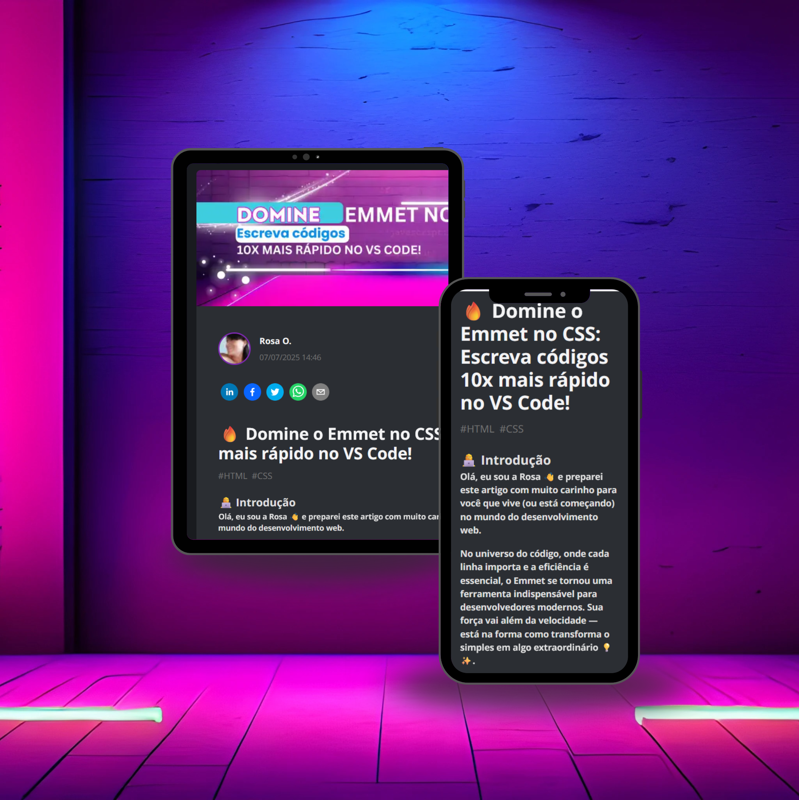

    

  
  

🌷🌷🌷🌷🌷🌷🌷🌷🌷🌷🌷🌷🌷🌷🌷🌷🌷🌷🌷🌷🌷🌷🌷🌷🌷🌷🌷🌷🌷🌷🌷🌷🌷🌷🌷🌷🌷🌷🌷🌷🌷🌷🌷🌷🌷🌷🌷🌷🌷🌷🌷🌷🌷🌷🌷🌷🌷🌷🌷🌷🌷🌷🌷🌷🌷🌷🌷🌷🌷🌷🌷

  

# Projeto artigo técnico gerado por I.A.s

 > ℹ️ **NOTE:** Olá, eu sou a Rosa 👋 e preparei este artigo com muito carinho para você que vive (ou está começando) no mundo do desenvolvimento web.

🛡️🎉No universo do código, onde cada linha importa e a eficiência é essencial, o Emmet se tornou uma ferramenta indispensável para desenvolvedores modernos. Sua força vai além da velocidade — está na forma como transforma o simples em algo extraordinário 💡✨.

Te convido a continuar lendo e descobrir como escrever código de forma mais rápida, inteligente e criativa com Emmet no VS Code ⚡💻
<a href="https://web.dio.me/articles/domine-o-emmet-no-css-escreva-codigos-10x-mais-rapido-no-vs-code-8b3d3b3f9659?back=/articles" title="View PDF now"> 📕Clique aqui para ler o artigo</a>

## 💻 Tecnologias utilizadas no projeto

- [ChatGPT](https://chat.openai.com/) - para título e conteúdo
- [adobe firefly ai](https://firefly.adobe.com/) - para gerar imagens

## 📄 Prompts e ferramentas

ChatGPT：

|   Ação   | prompt                                                                                                                                                                                                                                                                         |
| :------: | ------------------------------------------------------------------------------------------------------------------------------------------------------------------------------------------------------------------------------------------------------------------------------ |
|  título  | Crie 05 headlines para nomes de artigos sobre o assunto Emmet no CSS - Exemplo de atalhos.                                                                                                                                                                                                   |
| conteúdo | Faça um texto para artigo , com foco em CSS, Emmet no CSS – Como escrever código 10x mais rápido no VS Code {REGRAS} Explique sempre de uma maneira simples 

Adobe firefly ai

- No Adobe Firefly busquei imagens geradas por prompts na área de tecnologia:

• Emmet E

## ✨ Features

- Conteúdo gerado via ChatGPT
- Imagens geradas pelos promts no Firefly ai.

## 📚 Materiais

- prompts utilizados

## 🛠️ Instruções de execução

Utilize os prompts acima nas ferramentas sugeridas para gerar o material base e utilize uma ferramenta de edição de documentos como power point, canva para editar imagens.
## 👨‍💻 Expert

    
    
&nbsp&nbsp&nbspRosa Virginia Flores 
    &nbsp&nbsp&nbsp
    <a href="https://github.com/Rosavf">
    GitHub</a>&nbsp;|&nbsp;
    <a href="https://www.linkedin.com/in/rosa-virginia-flores/">LinkedIn</a>
&nbsp;|&nbsp;
    <a href="https://www.instagram.com/edt.creative/">
    Instagram</a>
&nbsp;|&nbsp;

  

---
🦋✨🌷✨🌷🌷
⌨ 👩‍💻 Mais que código: é expressão –  [Rosa Virginia](https://github.com/Rosavf)